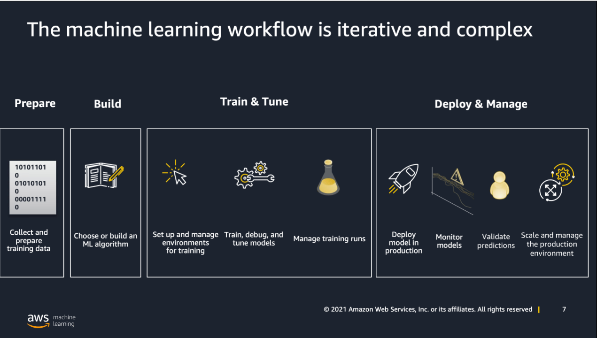
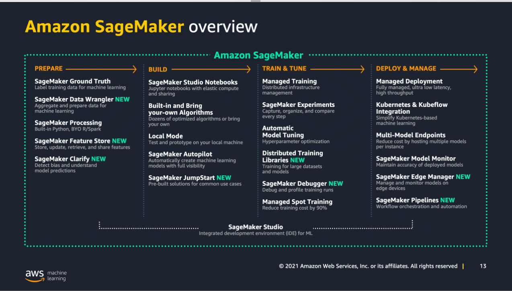
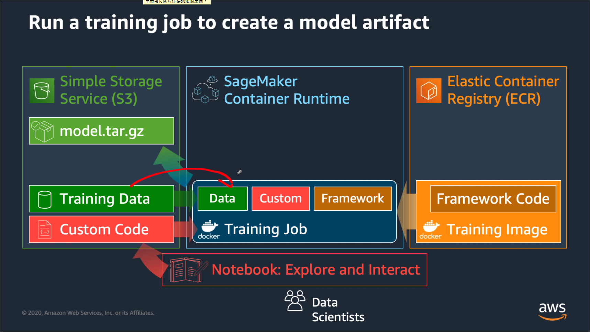

# AI/ML Starup webinar

## Getting Started with AIML (8/31)

### Quick intro to AI/ML

- ML is a subset of AI, and the more data, the better.

- Deep Leaning is a subset of ML

- Quick example of ML use case: Marketing Offer of a New Product

Human's work: lots of if-else

but with ML: human create learning algo.

### AIML Stack that aws offers

- ML is only possible with a great amount of data

- At the bottom level: ML frameworks and infrastuctures

Example of using these: Running on local or EC2 to use own algorithms to train models

- 2nd level: SageMaker

Using SageMaker, we don't need to care about managing all the hardware and software while training

- Top level: AI services

as known as: 0 data scientests services/ machine learning without a PhD

does not require infrastuctures, model, training, algos, only dataset

- for startups, go straight to AI services

### 4 common use cases for startups

1. Image and Video Analysis

use Amazon Rekognition. Training data needs to be in S3

2. Recommandation based on past orders

use Amazon Personalize. Also based on S3

3. Invoice processing

use Amazon Textract

4. Sentiment detection from amazon.com user reviews, analyze tone of sentiment

use Amazon Comprehend

### SageMaker Studio

Traditionally, ML:

- Building own model can be tricky, and it requires **knowledge**

- Setting up scalalbe models and servers for infercing is hardware

but with SageMaker Studio:

- A fully integrated IDE, which means it is a gateway to many tools with single interface

- Only needs to write code and

SageMaker overview

### SageMaker JumpStart

- use SageMaker JumpStart like an open source software-grab one of these models, transform it, and use it

- popular use cases: churn prediction(predict if constumers are to dump the service), predictive maintenance(device need maintenance or not), vast field of Computer Vision

- greatly reduce time for building model

### AWS Startup Programs' ABC

### Q & A

- Q: What is the best way for outputing an ML report?

A: It depends. If the report were to be access by not a lot of people, S3 plus QuickSight, but if needed to present to a lot of people, it's better to host a website to present it.

- Q: How can I use the model if I want to use it in a webapp?

A: When a model is ready, you can setup an Endpoint, and it can be API wherever you like.

- Q: How to I know which service I'm gonna use when facing a certain problem?

A: Always go for AI services first. AI services are off-the-shelf, and can be modified to an extent to meet your needs. If the AI services don't meet your needs, go for SageMaker to build your own solutions. The most significant part of SageMaker is to cut away the management of infrastuctures when doing ML.

## Recommandations with Amazon Personalize (8/31)

- commonly used in: retail industry, e-commerce (for product recommandation), media industry (for personalized recommandation)

- Personalize has **NO** data cleaning, have to make sure data is in right shape when using

- [hands-on demo](https://personalization-immersionday.workshop.aws/en/getting-started.html), [github](https://github.com/apac-ml-tfc/personalize-poc)

## Build, Train, and Deploy with Amazon SageMaker (9/1)

### SageMaker

- It's hard to share SageMaker notebook instance with colleagues, but SageMaker Studio solves this problem.

- Traditionally, hyperparameters tuning is hard, but hyperparameters tuning can be automated in SageMaker.

- SageMaker Ground Truth makes labeling image and text easier.

- SageMaker Studio is an integrated IDE, making exploring and experimenting much easier.

- SageMaker model endpoint can be interact with Rest api.

### 4 options to train model

1. Using SageMaker built-in algos (e.g. Xgboost)

2. Use costum scripts on supported frameworks

3. Bring your own algos and frameworks

4. Marketplace

- SageMaker has 17 built-in algorithms

- Under the hood: SageMaker assumes data is stored in S3

- You only need to focus on coding while using SageMaker Studio, the infrastucture part is handled.

- Endpoint is in RestAPI form, and can be customize for batch or single.

- When performing easier tasks, use lower tier processors to reduce cost.

- SageMaker training and traditional training

### Hands-on on option1 (using SageMaker built-in algos)

- SageMaker Studio is based on JupyterLab

- SageMaker Python SDK will enable you to train, deploy models with simple API in Jupyter notebook.

- Under the hood, SageMaker SDK calls boto3, but it is easier to use SM SDK.

- **Always** use spot instance when training. It saves a great amount of money.

- To interact with Endpoint, you need authentication. You can do this the hard way using Signature V4, or the easier way using SDKs.

- hands-on demo: [immersionday](https://sagemaker-immersionday.workshop.aws/en/prerequisites.html), `builtin_algorithm_hpo_tabular` under [sagemaker-101-workshop](https://github.com/aws-samples/sagemaker-101-workshop)

### Hyperparameters Optimization

- Need to setup hyperparameters' range and specify objective matric

- Use tuner class to wrap

- launch HPO

- hands-on [demo](https://github.com/aws-samples/sagemaker-101-workshop/blob/main/builtin_algorithm_hpo_tabular/SageMaker%20XGBoost%20HPO.ipynb)

### Hands-on on option2 (use costum scripts on supported frameworks)

- hands-on demo: [immersionday](https://sagemaker-immersionday.workshop.aws/en/lab3/option2.html), `custom_tensorflow_keras_nlp` under [sagemaker-101-workshop](https://github.com/aws-samples/sagemaker-101-workshop/tree/solution)

- schema

- when training

- when deploying

- I/O interfaces

### Recap

- You can use SageMaker SDK to use SageMaker on local machine

- SageMaker use ECR to use others' image

## Image and Video Analysis with Amazon Rekognition (9/2)

- use case: media analysis, content moderation, workplace safety

- [hands-on demo](https://rekognition-immersionday.workshop.aws/rek_apis.html)

### AUGMENTED AI (A2I)

- ML + humans working together

- If the confident index output from a model is below threshold, human makes the decision.

- [hands-on demo](https://rekognition-immersionday.workshop.aws/en/a2i_rek.html)

## Making Sense of Documents with Amazon Textract and Amazon Comprehend (9/2)

- use case: NLP, docs to data, sentiment detection

- [hands-on demo](https://comprehend-immersionday.workshop.aws/prerequisites.html)
